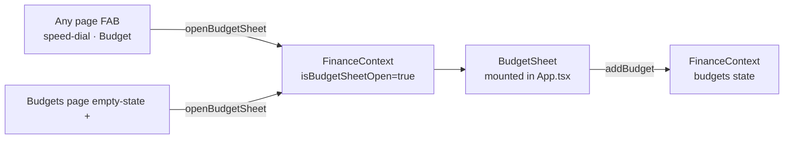

# Budgets Accordion + FAB Speed-Dial + Sorted Categories + CC (due) Label

**Feature branch**: `feature/budgets-fab-ux-on-sms-auto-import`
**Commit**: `3e51330`
**Cut from**: `feature/sms-auto-import-phase-1-foundation` @ `5e9e32c`
**Delivered**: 2026-08-28
**Scope**: `artifacts/financial-clarity/` (Vite + React 18 + Capacitor). No backend, DB, or shared-lib changes.

---

## 1. What shipped

Four independent UX improvements bundled into a single feature branch:

| # | Improvement | Where |
|---|-------------|-------|
| 1 | Category dropdowns sorted A–Z | TransactionSheet, BudgetSheet, RecurringExpenses category picker |
| 2 | "Credit Card" payment method relabelled to **Credit Card (due)** | TransactionSheet payment-method dropdown |
| 3 | Budgets page splits **active** vs **fully-used** budgets; used-up items live inside a collapsible **Fully used (N)** accordion | [Budgets.tsx](../../artifacts/financial-clarity/src/pages/Budgets.tsx) |
| 4 | FAB is now a **4-option speed-dial** (Expense · Income · Budget · Savings) on Dashboard, Transactions, Budgets | [FAB.tsx](../../artifacts/financial-clarity/src/components/FAB.tsx), [useDefaultFabMenu.tsx](../../artifacts/financial-clarity/src/hooks/useDefaultFabMenu.tsx) |

Non-goals (intentionally untouched):
- Cash-flow math (`getCarryForward`, `getNetBalanceToDate`, `isConsumptionExpense`).
- Recurring page FAB — keeps its single Add-recurring action.
- Backend / DB / OpenAPI contract.

---

## 2. Files changed

**Modified (9)**

| File | Purpose of change |
|------|-------------------|
| [App.tsx](../../artifacts/financial-clarity/src/App.tsx) | Mounts new `<BudgetSheet />` next to `<TransactionSheet />`. |
| [context/FinanceContext.tsx](../../artifacts/financial-clarity/src/context/FinanceContext.tsx) | Adds `sheetInitialMode`, `openSheet(mode?)`, `openBudgetSheet`, `closeBudgetSheet`, `isBudgetSheetOpen`. |
| [context/FabContext.tsx](../../artifacts/financial-clarity/src/context/FabContext.tsx) | Adds `FabMenuItem[]` support on `FabActionOptions` + new `useFabMenu(items, testId?)` hook. |
| [components/FAB.tsx](../../artifacts/financial-clarity/src/components/FAB.tsx) | Menu mode: tap toggles fan-out; backdrop + 4 mini-buttons; main FAB rotates plus↔X. |
| [components/TransactionSheet.tsx](../../artifacts/financial-clarity/src/components/TransactionSheet.tsx) | Sorts categories, "Credit Card (due)" label, honors `sheetInitialMode`. |
| [pages/Budgets.tsx](../../artifacts/financial-clarity/src/pages/Budgets.tsx) | Splits active/used-up; used-up accordion; auto-open on `?highlight=`; removed local add-budget sheet; uses `useDefaultFabMenu()`. |
| [pages/Dashboard.tsx](../../artifacts/financial-clarity/src/pages/Dashboard.tsx) | FAB → `useDefaultFabMenu()`. |
| [pages/Transactions.tsx](../../artifacts/financial-clarity/src/pages/Transactions.tsx) | FAB → `useDefaultFabMenu()`. |
| [pages/RecurringExpenses.tsx](../../artifacts/financial-clarity/src/pages/RecurringExpenses.tsx) | Categories sorted A–Z. FAB unchanged. |

**Added (2)**

| File | Purpose |
|------|---------|
| [components/BudgetSheet.tsx](../../artifacts/financial-clarity/src/components/BudgetSheet.tsx) | Global add-budget sheet, mounted once in `App.tsx`, controlled by `FinanceContext.isBudgetSheetOpen`. Owns local `newCatId` / `newLimit`. Alphabetized `unbudgetedCategories`. Empty-state message when all categories already have a budget. |
| [hooks/useDefaultFabMenu.tsx](../../artifacts/financial-clarity/src/hooks/useDefaultFabMenu.tsx) | Registers the 4-item speed-dial via `useFabMenu`. Wires Expense/Income/Save to `openSheet('expense'\|'income'\|'save')` and Budget to `openBudgetSheet()`. |

---

## 3. Architecture — before vs after

### 3.1 Add-budget flow

**Before**: Budgets page owned its own `<Sheet open={showAddBudget}>` with local `newCatId`/`newLimit` state and a `handleAddBudget` closure. Only reachable from the Budgets FAB and the empty-state "+" button.

**After**: A single global `<BudgetSheet />` component is mounted at the app root. Any page can open it by calling `openBudgetSheet()` from `useFinance()`. Same pattern as the existing `<TransactionSheet />`.



### 3.2 FAB speed-dial

**Before**: Every page called `useFabAction(callback, label, testId)` — one action per FAB. Tap invokes the single callback.

**After**: `useFabAction` still works unchanged. New `useFabMenu(items, testId?)` variant registers a `menuItems: FabMenuItem[]` payload. `FAB.tsx` detects menu-mode:

- Tap on main FAB toggles local `menuOpen`, rotates the icon plus↔X (`animate={{ rotate: 45 }}`), sets `aria-expanded`.
- Renders a full-screen backdrop (`data-testid="fab-backdrop"`).
- Fans out mini-buttons at `bottom-36 right-5 md:bottom-24 md:right-8`. Each item = label pill + colored circle with icon.
- Tapping a mini-item closes the menu, then `setTimeout(..., 0)` fires the item's `onClick` — this ordering prevents the opened sheet from being rendered behind an animating fan.

Default menu registered by `useDefaultFabMenu`:

| Item | Icon | Color | Action | Test ID |
|------|------|-------|--------|---------|
| Add expense | `Minus` | red-500 | `openSheet('expense')` | `fab-menu-expense` |
| Add income | `Plus` | emerald-500 | `openSheet('income')` | `fab-menu-income` |
| Add budget | `Target` | accent | `openBudgetSheet()` | `fab-menu-budget` |
| Add savings | `PiggyBank` | sky-500 | `openSheet('save')` | `fab-menu-save` |

Main FAB retains `data-testid="fab-add"`.

### 3.3 Budgets accordion

Data flow:

```
allBudgetsWithData
  └─ filter(!isSavings).sort(pct desc)   →  budgetsWithData
       ├─ filter(pct < 100)              →  activeBudgets       (rendered top)
       └─ filter(pct >= 100)             →  usedUpBudgets       (rendered inside accordion)
```

- The card JSX is factored into a local `renderBudgetCard(b, i)` helper so both lists share one render function.
- Accordion is controlled: `<Accordion type="single" collapsible value={usedUpAccordionValue} onValueChange={setUsedUpAccordionValue}>`.
- Deep-link handler: `?highlight=<categoryId>` looks up whether the target is in `usedUpBudgets`; if yes, it pre-sets `usedUpAccordionValue = 'used-up'` before scrolling.

### 3.4 TransactionSheet — CC (due) & sheetInitialMode

- Payment method dropdown option for `credit-card-payment` now displays "Credit Card (due)". Enum value and downstream math are unchanged.
- `useFinance()` now exposes `sheetInitialMode: 'expense' | 'income' | 'save' | null`. When the sheet opens in add-mode (`!editingTxnId`), the mode reset effect uses `setMode(sheetInitialMode ?? 'expense')` so the FAB speed-dial can pre-select Income or Savings.

---

## 4. Test-ids catalogue

Preserved (do not break existing tests):
- `fab-add`, `fab-add-transaction`, `fab-add-recurring`
- `budget-{id}`, `edit-budget-{id}`, `delete-budget-{id}`, `edit-limit-{id}`
- `budget-category-select`, `budget-limit-input`, `budget-save`
- `transfer-budget-button`, `budget-surplus-bar`, `savings-budget-{id}`, `savings-budget-sub`
- `empty-add-budget`

New (add tests against these later if needed):
- `fab-menu-expense`, `fab-menu-income`, `fab-menu-budget`, `fab-menu-save`
- `fab-backdrop`
- `budget-used-up-toggle`, `budget-used-up-list`
- `budget-no-categories` (BudgetSheet empty state)

---

## 5. How to verify manually

Prereq: `pnpm install` at repo root (SMS Phase 5a lockfile already applies).

```powershell
cd artifacts/financial-clarity
pnpm dev
```

Then in the app:

1. **Sort check** — Add a new transaction, open the category dropdown → verify alphabetical order. Same for Budgets (tap FAB → Add budget) and Recurring.
2. **CC (due) label** — Add transaction, open Payment method → the credit-card-payment option should read "Credit Card (due)".
3. **Speed-dial** — On Dashboard/Transactions/Budgets, tap the FAB. Four options fan out (Expense, Income, Budget, Save). Tap any → correct sheet opens with correct initial mode. Tap outside (backdrop) → menu collapses. On Recurring, FAB still opens the single Add-recurring sheet.
4. **Budgets accordion** — Create a category, set a low budget (say ₹100), record an expense of ₹150 in that category. Navigate to Budgets → the fully-used one appears under the "Fully used (1)" accordion. Active budgets remain in the top list.
5. **Highlight deep-link** — On Dashboard, if there's an alert chip for an over-budget category, tap it. Budgets opens, the used-up accordion auto-expands, and the card scrolls into view with a brief amber ring.

---

## 6. Verification results

Ran automatically at commit time:

- `pnpm run typecheck` — **clean** across 4 packages (financial-clarity, api-server, mockup-sandbox, scripts).
- `pnpm --filter '@workspace/financial-clarity' exec vitest run` — **187/187 passing**.

No dedicated regression tests were added for the new UI (accordion split, FAB menu). The existing suite covers all touched contracts.

---

## 7. Roll-back / undo

Local-only revert:
```powershell
git revert 3e51330
```

Full branch abandonment (if unmerged):
```powershell
git checkout feature/sms-auto-import-phase-1-foundation
git branch -D feature/budgets-fab-ux-on-sms-auto-import
git push origin --delete feature/budgets-fab-ux-on-sms-auto-import
```

Because the commit adds two new files and modifies existing ones without touching persistence, storage, or backup schema, an undeployed revert leaves no data-migration debt.

---

## 8. Follow-ups / open questions

- **Knowledge-base entries** — the App Oracle should record: the new `<BudgetSheet />` component, `useDefaultFabMenu` hook, extended `FinanceContext` shape, `useFabMenu` variant, and the Budgets accordion pattern. This manual is a working reference; the KB entries under [docs/knowledge-base/architecture/financial-clarity.md](../knowledge-base/architecture/financial-clarity.md) are the canonical record.
- **Feature tests** — consider adding a Budgets accordion test (asserts fully-used items render inside `budget-used-up-list` and NOT in the top list at `pct >= 100`) and a FAB menu test (asserts `fab-menu-*` items appear on Dashboard, not on Recurring).
- **Threshold** — accordion split is currently at `pct >= 100`. If usability testing suggests users want warning-level (`pct >= 75`) also collapsed, that's a one-liner change in `activeBudgets`/`usedUpBudgets` memos.
- **Motion polish** — the fan-out uses `motion.button` with default spring. If the animation feels too fast/slow on Android hardware, tune the `transition` on the mini-items in `FAB.tsx`.

---

## 9. PR link

`https://github.com/wishvesh-ujawane/Finance-Clarity-Android-App/pull/new/feature/budgets-fab-ux-on-sms-auto-import`
